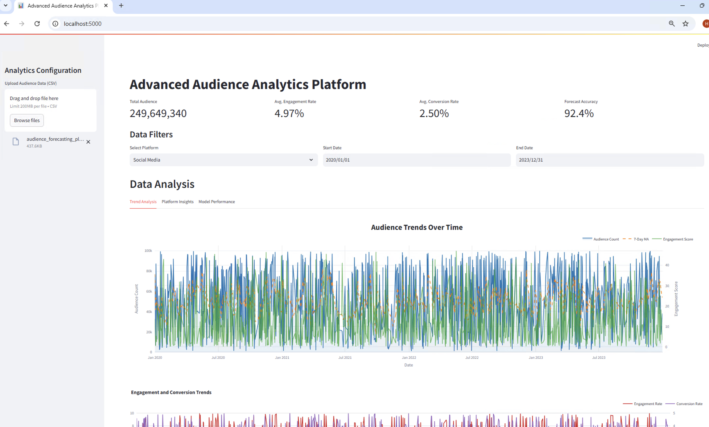
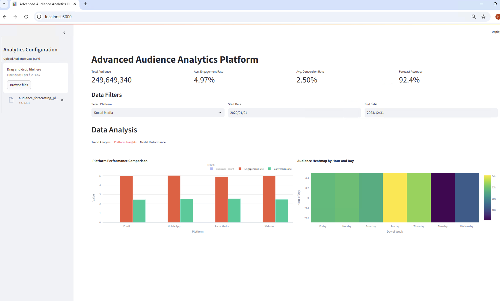
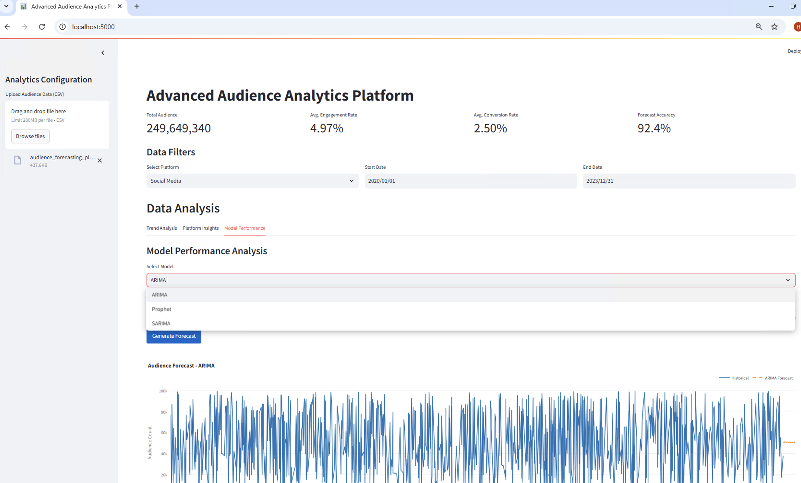

Advanced Audience Analytics Platform
====================================

👋 **Welcome to the Advanced Audience Analytics Platform!**

This platform empowers users with state-of-the-art audience analytics and forecasting tools. It provides a robust solution for businesses, marketers, and analysts to explore multi-platform audience engagement, analyze trends, and generate accurate forecasts using cutting-edge machine learning models.

* * * * *

🚀 Features
-----------

### 1\. **Multi-Platform Audience Analysis**

-   Analyze audience behavior across platforms like websites, mobile apps, social media, and email campaigns.
-   Interactive visualizations for understanding audience engagement, trends, and conversion metrics.

### 2\. **Advanced Time Series Forecasting**

-   Models supported: ARIMA, SARIMA, and Prophet.
-   Provides future audience insights using historical data.

### 3\. **Engagement Metrics Visualization**

-   Visualize key metrics such as engagement rates, conversion rates, and platform-specific performance.
-   Heatmaps to explore audience engagement by day and time.

### 4\. **Model Performance Comparison**

-   Compare the accuracy and performance of forecasting models.
-   Easily switch between models to select the best-performing one for your dataset.

### 5\. **Interactive Dashboard**

-   Built with **Streamlit**, the dashboard offers real-time analysis, data filtering, and audience forecasting capabilities.
-   User-friendly interface for both technical and non-technical users.

* * * * *

🛠️ How It Works
----------------

1.  **Upload Your Data**

    -   Upload a CSV file containing audience metrics (e.g., engagement rates, audience count, conversion rates).
    -   Example: A CSV with columns like `Date`, `Platform`, `AudienceCount`, and `EngagementRate`.
2.  **Explore Audience Trends**

    -   View time-series visualizations of audience behavior over a specific period.
    -   Analyze daily, weekly, and monthly trends.
3.  **Select a Model for Forecasting**

    -   Choose from supported models (e.g., ARIMA, Prophet, SARIMA).
    -   Generate audience forecasts and compare results.
4.  **Platform Insights**

    -   Explore platform-specific performance through bar charts and heatmaps.
5.  **Model Performance Analysis**

🖥️ Screenshots
---------------

### **Dashboard Overview**

### **Platform Insights**
 
### **Model Performance Analysis**

🤝 Contributions
----------------

Contributions are welcome! If you have ideas or improvements, feel free to open an issue or create a pull request.

* * * * *

📄 License
----------

This project is licensed under the MIT License. See the `LICENSE` file for details.
    -   Visualize and evaluate the accuracy of different forecasting models.
    -   Fine-tune and retrain models as needed.

